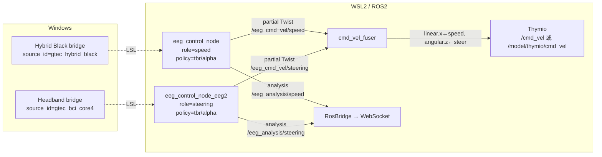
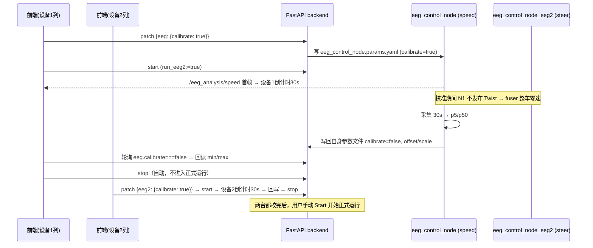

# Phase 3 双设备（Dual-device）架构设计

> 版本：v1.0（设计稿，尚未实现）
> 日期：2026-08-03
> 作者：项目架构师
> 状态：待评审

---

## 1. 文档信息

| 项目 | 说明 |
|---|---|
| 目标版本 | v3.0 → v3.1 |
| 分支 | `feature/gtec-only` |
| 对应任务 | P3.1（UI + backend 双设备建模）、P3.2（双设备路由） |
| 前置条件 | P1.1–P1.4、P2.1–P2.6 全部完成 |

---

## 2. 范围与目标

### 2.1 任务定义（来自 TASKS.md）

- **P3.1 — UI + backend 双设备建模**：前端支持第二台设备的角色/品牌/协议/通道/指标配置；后端数据模型补齐 `EegConfig2` 缺失的校准字段（`calibrate` / `calib_offset` / `calib_scale`），使双设备校准可用。
- **P3.2 — 双设备路由**：一台设备负责 speed（前进速度），另一台负责 steering（转向），按配置将各自 intent 合成最终的 Twist，发布到 `/cmd_vel`。

### 2.2 成功标准

1. 单设备模式行为**零回归**：启动、校准、发布主题、WebSocket 负载均与现状一致。
2. 双设备模式下，两个 LSL 流可同时接入；speed 设备只控制 `linear.x`，steering 设备只控制 `angular.z`，互不覆盖。
3. 每台设备可独立完成 30 秒校准，校准结果（p5/p50 → offset/scale）持久化到**各自独立的参数文件**，互不覆盖。
4. 前端双列图表各自展示对应设备的数据；每列有独立的校准入口与 min/max 手动编辑。
5. 校准交互：单设备校准后系统继续运行（现状不变）；双设备每台设备独立校准，校准结束后**自动停止**，不自动进入正式运行。
6. 任一设备断流时，机器人**零速停车**（fail-safe），恢复后自动续跑。
7. 新增单元测试覆盖：融合逻辑、watchdog、双设备配置持久化、模型校验。

---

## 3. 现状分析

### 3.1 现有架构（单设备）

```
Windows:
  gpype_lsl_bridge.py        (BCI Core-4 → LSL, source_id/gtec_bci_core4)
  unicornpy_lsl_bridge.py    (Hybrid Black → LSL, source_id/gtec_hybrid_black)
        ↓ LSL (250 Hz)
WSL2:
  RawLslAdapter (resolve_byprop source_id) → Welch PSD → enrich_features
    → Policy.compute_intents() → role 映射 → Twist → /cmd_vel
                                            → analysis JSON → /eeg_analysis
  web_gui: FastAPI (8010) + React (5173)
    RosBridge (rclpy 线程) 订阅 /eeg_analysis → WebSocket /ws/stream
```

关键事实：

- `eeg_control_node.py` 通过 `role` 参数（`speed` / `steering`）决定 Twist 映射：
  - `speed` → `linear.x = max_forward_speed × speed_intent`，`angular.z = 0`
  - `steering` → `linear.x = 0`，`angular.z = -steer_direction × turn_angular_speed × |steer_intent-0.5|`
- 校准：节点收集 30 秒策略指标 → p5/p50 → 写回 `eeg_control_node.params.yaml` → 重建 policy。
- 数据看板（RosBridge）只订阅 `/eeg_analysis`；前端双列图表是**占位**，共用同一份 series。
- 前端已存在双设备 UI 骨架（role1/role2、品牌、指标、双列 ChartColumn），但 `buildPatch` 写出的 `eeg2` 块缺少校准字段，且后端不消费它。

### 3.2 差距清单

| # | 层 | 差距 | 引用 |
|---|---|---|---|
| G1 | 模型 | `EegConfig2` 缺 `calibrate/calib_offset/calib_scale` | `web_gui/backend/app/models.py` |
| G2 | 配置 | 第二个节点没有独立参数文件，校准回写会互相覆盖 | `eeg_control_node.py::_finish_calibration` 硬编码文件名 |
| G3 | 编排 | launch 只启动一个 eeg 节点；无融合节点 | `experiment_core.launch.py` |
| G4 | 后端 | `command_runner` 不传双设备参数；RosBridge 单主题；WS 负载单设备 | `command_runner.py` / `signal_subscriber.py` / `main.py` |
| G5 | 前端 | 双列共用 series；校准 UI 只有一套；eeg2 补丁缺校准字段 | `App.jsx` |
| G6 | 进程清理 | `_KILL_PATTERNS` 缺融合节点 | `command_runner.py` |
| G7 | 安装 | 新脚本未注册到 CMake 安装列表 | `thymio_control/CMakeLists.txt` |

### 3.3 隐藏问题（现状代码里已埋的雷）

1. **双节点争用 `/cmd_vel`**：两个节点若都发布 Twist 到 `/cmd_vel`，最后一帧胜出，speed/steering 互相覆盖 —— 必须有融合层。
2. **双节点同名**：ROS2 同一 domain 内节点名必须唯一，第二个节点必须改名。
3. **双节点 CSV 冲突**：默认 `csv_path` 都是 `/tmp/thymio_eeg_log.csv`，双设备时两个节点写同一文件。
4. **设备断流时的"短暂回放"**：单设备断流后**宽限期内（< 0.5s）回放最后 intents**，超时后发一次零速并静默（watchdog 语义，**非**永续回放——设计初版 §5.3.1 误述为"持续重发"，2026-08-04 更正，见 review N1）。双设备若沿用宽限回放，断流后 speed/steering 会继续用旧值 ~0.5s，融合层靠"静默"感知会延迟 —— 故双设备用 `stop_on_data_loss` 使节点**断流即静默**。
5. **LED 争用**：`_update_leds()` 与 role 无关，speed 节点也会向 `/led` 发布圆弧 LED；双节点会互相覆盖。
6. **进程清理遗漏**：`pkill -f eeg_control_node` 能匹配两个节点（子串匹配），但融合节点需要新 pattern。

---

## 4. 总体方案

### 4.1 推荐方案（A）：两个 eeg 节点 + 一个融合节点



### 4.2 备选方案（B）：单节点双流水线（已否决）

在一个 `eeg_control_node` 内部跑两条 adapter → processor → policy 流水线，内部合并。

否决理由：

- `eeg_control_node.py` 是 Phase 1–2 验证过的核心代码，内含校准、blink 确认、hold-off、watchdog、CSV、分析发布；改双流水线是大手术。
- 单设备模式回归风险高，违背 AGENTS.md「手术式改动 / 简单优先」。
- 双源故障隔离差：一条流水线崩溃会拖垮整个节点。

### 4.3 决策记录

| 决策点 | 选择 | 理由 |
|---|---|---|
| D1 拓扑 | 双节点 + 融合节点 | 复用已验证代码，单设备零改动，故障隔离 |
| D2 主题命名 | 按 **role** 命名（`/eeg_analysis/speed`、`/eeg_cmd_vel/steering`…） | 融合节点订阅位置固定；与前端按 role 分列对齐 |
| D3 融合语义 | 任一输入过期 → 零速 | 双源控制中沿用旧转向有失控风险（fail-safe） |
| D4 设备断流 | 双设备模式节点**停止发布** partial Twist（stop_on_data_loss） | 融合层靠"静默"感知断流，而不是被陈旧回放欺骗 |
| D5 配置源 | 每设备独立参数文件；`launch_args.yaml` 只留 `run_eeg2` 开关 | 校准回写互不干扰；配置单一来源 |
| D6 校准交互 | 单设备维持现状（校准后继续运行）；双设备每列独立校准按钮，校准结束**自动停止**，不自动 start | 避免"半校准"状态开车；复用现有交互心智，实现成本低 |
| D7 分析负载 | WS 升级为 `devices: {role: frame}` | 前端按 role 取数，语义清晰 |
| D8 主题后缀 | 双设备主题后缀用 **role 字面量**（`/eeg_cmd_vel/steering`，非 `steer`） | role 字面量统一为 `speed`/`steering`，避免 `steering→steer` 隐式映射表；与 WS 负载 `devices: {speed, steering}` 键一致（2026-08-03 CTO 裁定，见 REVIEW_FINDINGS O1） |

---

## 5. 详细设计

### 5.1 主题与命名

| 模式 | 主题 | 发布者 → 订阅者 |
|---|---|---|
| 单设备 | `/eeg_analysis` | eeg 节点 → RosBridge |
| 单设备 | `/cmd_vel`（或仿真 `/model/thymio/cmd_vel`） | eeg 节点 → Thymio |
| 双设备 | `/eeg_analysis/speed`、`/eeg_analysis/steering` | 各 eeg 节点 → RosBridge |
| 双设备 | `/eeg_cmd_vel/speed`、`/eeg_cmd_vel/steering` | 各 eeg 节点 → fuser（partial Twist） |
| 双设备 | `/cmd_vel`（或仿真） | fuser → Thymio |

节点名：

- `eeg_control_node`（设备 1，保留默认名）
- `eeg_control_node_eeg2`（设备 2，必须改名避免 DDS 冲突）
- `cmd_vel_fuser`（新增）

设计要点：

- **单设备模式不启动 fuser**，节点直连最终主题，行为与今天完全一致。
- **双设备模式的 role 与设备绑定完全由配置驱动**（`lsl_source_id` + `role`），"headband→steer、hybrid→speed"只是 P3.2 的推荐默认排布，不硬编码。
- RosBridge **始终订阅 3 个分析主题**（`/eeg_analysis`、`/eeg_analysis/speed`、`/eeg_analysis/steering`）。单设备时后两个静默，双设备时第一个静默；无需在配置切换时重建订阅。

### 5.2 数据契约

#### 5.2.1 后端模型（`web_gui/backend/app/models.py`）

```python
class LaunchConfig(BaseModel):
    use_sim: bool = True
    use_gui: bool = True
    run_eeg: bool = False
    run_eeg2: bool = False          # 新增：双设备开关（launch_args.yaml 单一来源）
    run_rviz: bool = False
    device: str = ""


class EegConfig(BaseModel):
    input: str = "lsl"
    role: Literal["speed", "steering"] = "speed"
    policy: Literal["ei", "tbr", "alpha"] = "tbr"
    calibrate: bool = False
    calib_offset: float = 0.0
    calib_scale: float = 1.0
    lsl_stream_type: str = "EEG"
    lsl_timeout: float = 8.0
    lsl_source_id: str = ""


class EegConfig2(BaseModel):        # 与 EegConfig 完全对齐（P3.1 核心）
    input: str = "lsl"
    role: Literal["speed", "steering"] = "steering"
    policy: Literal["ei", "tbr", "alpha"] = "tbr"
    calibrate: bool = False         # 新增
    calib_offset: float = 0.0       # 新增
    calib_scale: float = 1.0        # 新增
    lsl_stream_type: str = "EEG"
    lsl_timeout: float = 8.0
    lsl_source_id: str = ""


class AppConfig(BaseModel):
    launch: LaunchConfig = Field(default_factory=LaunchConfig)
    eeg: EegConfig = Field(default_factory=EegConfig)
    eeg2: EegConfig2 | None = None
    motion: MotionConfig = Field(default_factory=MotionConfig)

    @model_validator(mode="after")
    def _dual_roles_must_differ(self):
        if self.eeg2 is not None and self.eeg.role == self.eeg2.role:
            raise ValueError("dual-device mode requires eeg and eeg2 roles to differ")
        return self


class DeviceFrame(BaseModel):       # 新增：单设备分析帧
    channels: dict[str, float]
    features: dict[str, float]
    control: dict[str, float]
    timestamp: float


class WsFrame(BaseModel):           # 升级：devices 按 role 索引
    status: SystemStatus
    devices: dict[str, DeviceFrame]
    timestamp: float | None = None
```

说明：

- `role` 字面量统一为 `"speed"` / `"steering"`（注意是 `steering`，不是 `steer`）。
- `brand` 字段仍是前端本地状态，后端模型不接收（pydantic 默认忽略多余字段），保持不变。

#### 5.2.2 参数文件（每设备一份）

设备 1：`thymio_control/config/eeg_control_node.params.yaml`（现状，仅补 `role: speed` 保持对称，launch 覆盖仍生效）。

设备 2（新增）：`thymio_control/config/eeg_control_node.eeg2.params.yaml`

```yaml
/**:
  ros__parameters:
    input: lsl
    policy: tbr
    lsl_stream_type: EEG
    lsl_timeout: 8.0
    lsl_source_id: gtec_bci_core4
    calibrate: false
    calib_offset: 0.0
    calib_scale: 1.0
    role: steering
    cmd_topic: /eeg_cmd_vel/steering
    analysis_topic: /eeg_analysis/steering
    publish_hz: 20.0
    watchdog_sec: 0.5
    verbose: false
    analysis_verbose: false
    record_csv: false
    csv_path: /tmp/thymio_eeg_log_eeg2.csv
    max_forward_speed: 0.2
    reverse_speed: -0.15
    turn_forward_speed: 0.1
    turn_angular_speed: 1.2
    steer_deadzone: 0.1
    line_mode: ''
    blink_holdoff_frames: 4
    blink_confirm_frames: 2
```

说明：

- `cmd_topic` / `analysis_topic` 的最终值由 launch 按 role 覆盖（`/eeg_cmd_vel/<role>`、`/eeg_analysis/<role>`），文件里的默认值只是兜底。
- `csv_path` 按节点隔离，避免双节点写同一文件。
- `stop_on_data_loss` **不写在参数文件里**，由 launch 在双设备模式下对两个节点统一覆盖（它是"双设备模式"这个 launch 级概念的行为，不是设备级配置）。

#### 5.2.3 launch 级配置（`launch_args.yaml`）

```yaml
use_sim: true
use_gui: false
run_eeg: true
run_eeg2: false          # 新增：双设备开关（由 backend 持久化）
use_teleop: false
run_rviz: false
eeg_config_file: eeg_control_node.params.yaml
device: ''
```

旧版 `eeg2:` 块（含 role/policy/lsl_source_id）在读取时做一次性迁移到设备 2 参数文件，之后不再写入（见 §5.4.2）。

#### 5.2.4 分析 JSON 契约（节点侧小改）

`eeg_control_node.py` 的 analysis 字典新增一个字段：

```python
analysis = {
    "ts": frame.ts,
    "source": frame.source,
    "role": "steering" if self._steer_role else "speed",   # 新增
    "metrics": frame.metrics,
    ...
}
```

作用：让 RosBridge 无需查配置即可从帧内容推断设备 role；旧节点（无此字段）由主题后缀或配置兜底。

#### 5.2.5 WebSocket 负载（`/ws/stream`）

```json
{
  "status": { "...": "..." },
  "devices": {
    "speed": {
      "channels": { "alpha": 0.1, "theta": 0.2, "beta": 0.3, "left_alpha": 0.1, "right_alpha": 0.1 },
      "features": { "theta_beta_ratio": 0.7, "focus_index": 1.2 },
      "control": { "speed_intent": 0.6, "steer_intent": 0.5, "steer_direction": 0 },
      "timestamp": 1754236800.0
    },
    "steering": { "...": "..." }
  },
  "timestamp": 1754236800.2
}
```

单设备模式：`devices` 里只有一个 role 有数据（即该设备配置的 role）。

### 5.3 ROS 层详细设计

#### 5.3.1 `eeg_control_node.py`（改动共 5 处，全部小改）

1. **新增参数 `calib_config_file`**（默认 `"eeg_control_node.params.yaml"`），`_finish_calibration()` 回写目标改为该参数指向的文件名：

```python
self.declare_parameter("calib_config_file", "eeg_control_node.params.yaml")
self._calib_config_file = str(self.get_parameter("calib_config_file").value)

# _finish_calibration() 内：
cfg_file = cfg_root / self._calib_config_file   # 替换硬编码文件名
```

2. **新增参数 `stop_on_data_loss`**（默认 `False`），改造 `_tick()` 的 watchdog 分支。watchdog 决策抽成纯函数 `decide_watchdog_action()`（`thymio_control/watchdog.py`），节点只做副作用（发布/置位）。

> ⚠️ **2026-08-04 更正**：本设计的初版**误述了单设备旧行为**（声称"断流后持续回放最后 intents"）。实际旧代码是：宽限内（`< watchdog_sec`）回放最后 intents → 超时瞬间发一次零速 → **此后静默**（非永续回放）。M2 曾按误述实现为永续回放，构成单设备回归（review N1），已在实现中纠正为真实旧语义，`stop_on_data_loss` 仅作为双设备语义开关。

```python
action = decide_watchdog_action(
    stale=time.time() - self.last_msg_ts > self.watchdog_sec,
    connected=self._adapter_connected,
    stop_on_data_loss=self.stop_on_data_loss,
)
if action == "replay":
    if not self._calibrate:                 # 宽限内：回放最后 intents
        self.pub.publish(self._intents_to_twist(self.last_intents))
    return
if self._adapter_connected:
    self._adapter_connected = False
    if action == "zero":                    # 单设备超时：发一次零速，随后静默
        self.pub.publish(Twist())
    else:                                   # 双设备：静默，让 fuser 接管
        self.get_logger().warning("data loss — partial twist halted (dual mode)")
```

语义（`decide_watchdog_action` 契约，见 `watchdog.py`）：

- 单设备（`stop_on_data_loss=False`，**真实旧行为，零回归**）：宽限内回放最后 intents → 超时发一次零速并停 → 不再发布。
- 双设备（`stop_on_data_loss=True`）：断流即**完全静默**（无宽限回放、无零速标记），融合层靠消息新鲜度感知 staleness 并整车零速；设备恢复后节点恢复发布，fuser 自动续跑。

3. **`_update_leds()` 增加 role 门控**（speed 节点一律不发 LED；同时消除双节点争用 `/led`）：

```python
def _update_leds(self):
    if self._led_circle is None or not self._steer_role:
        return
```

> 已确认的行为变更（2026-08-03）：speed 节点（含单设备模式）不再发布 LED。此前 speed 角色会恒亮右侧圆弧 LED（`steer_direction` 初始为 1 且从不翻转，`_update_leds` 又不看 role），显示上不合理；门控后只有 steering 节点按 blink 状态发左/右圆弧。

4. **analysis 字典加 `role` 字段**（见 §5.2.4）。

5. **声明 `stop_on_data_loss` / `calib_config_file` 参数**（含在 1、2 内）。

#### 5.3.2 新增 `thymio_control/scripts/cmd_vel_fuser.py`

职责：订阅两个 partial Twist，按 role 融合，带 watchdog 零速，发布最终 Twist。

参数：

| 参数 | 默认 | 说明 |
|---|---|---|
| `speed_topic` | `/eeg_cmd_vel/speed` | speed 节点 partial Twist |
| `steer_topic` | `/eeg_cmd_vel/steering` | steering 节点 partial Twist |
| `cmd_topic` | `/cmd_vel` | 最终输出（仿真时 `/model/thymio/cmd_vel`） |
| `publish_hz` | 20.0 | 融合发布频率 |
| `watchdog_sec` | 0.5 | 输入过期阈值 |
| `verbose` | false | 调试日志 |

模块级纯函数（便于无 ROS 单测）：

```python
def merge_twists(speed: "Twist", steer: "Twist") -> "Twist":
    """linear.x 来自 speed，angular.z 来自 steer，其余分量清零。"""
    out = Twist()
    out.linear.x = float(speed.linear.x)
    out.angular.z = float(steer.angular.z)
    return out


def build_command(speed, steer, speed_ok: bool, steer_ok: bool) -> "Twist":
    """任一输入缺失/过期 → 零速；否则融合。"""
    if not (speed_ok and steer_ok):
        return Twist()
    return merge_twists(speed, steer)
```

节点状态机（timer 驱动，20 Hz）：

```python
class CmdVelFuser(Node):
    def __init__(self):
        ...
        self._speed: Optional[Twist] = None
        self._steer: Optional[Twist] = None
        self._speed_ts = 0.0
        self._steer_ts = 0.0
        self._stopped = True          # 当前是否处于零速态（用于日志状态迁移）
        self.create_subscription(Twist, speed_topic, self._on_speed, 10)
        self.create_subscription(Twist, steer_topic, self._on_steer, 10)
        self.create_timer(1.0 / publish_hz, self._tick)

    def _on_speed(self, msg): self._speed, self._speed_ts = msg, time.time()
    def _on_steer(self, msg): self._steer, self._steer_ts = msg, time.time()

    def _tick(self):
        now = time.time()
        speed_ok = self._speed is not None and now - self._speed_ts <= self.watchdog_sec
        steer_ok = self._steer is not None and now - self._steer_ts <= self.watchdog_sec
        twist = build_command(self._speed, self._steer, speed_ok, steer_ok)
        # 日志状态迁移（防刷屏）：
        #   从未就绪/断流 → 零速；从零速 → 恢复融合，各打一次 info/warning
        self._pub.publish(twist)
```

设计要点：

- **不做任何策略计算**，纯数据平面，约 100 行。
- 零速判定不依赖"收到零值消息"（无法区分设备断流与用户放松），而是依赖**输入新鲜度**。
- 初始状态（两个主题都没数据）→ 持续零速；节点日志在 5 秒无数据后告警一次（防刷屏）。
- 校准期间节点不发布 partial Twist → fuser 自动零速，机器人安全停车。

#### 5.3.3 `experiment_core.launch.py`（改动）

新增 launch 参数：

| 参数 | 默认 | 说明 |
|---|---|---|
| `run_eeg2` | 读 `launch_args.yaml`，默认 false | 双设备开关 |
| `eeg2_input` | `lsl` | 第二节点输入 |
| `eeg2_role` | `steering` | 第二节点角色 |
| `eeg2_config_file` | `get_package_share_directory(...)/config/eeg_control_node.eeg2.params.yaml` | 第二节点参数文件 |

节点拓扑（条件式）：

```python
# 节点 1（现有节点，双设备时改发 partial + role 主题）
eeg1_cmd = PythonExpression(
    ["f'/eeg_cmd_vel/{", role, "}' if '", run_eeg2, "' == 'true' else '", cmd_topic, "'"]
)
eeg1_analysis = PythonExpression(
    ["f'/eeg_analysis/{", role, "}' if '", run_eeg2, "' == 'true' else '/eeg_analysis'"]
)
eeg_node = Node(
    ...,
    parameters=[eeg_config_file, {
        "cmd_topic": eeg1_cmd,
        "analysis_topic": eeg1_analysis,
        "input": eeg_input,
        "role": role,
        "stop_on_data_loss": PythonExpression(
            ["'true' if '", run_eeg2, "' == 'true' else 'false'"]
        ),
    }],
    condition=IfCondition(PythonExpression(
        ["'", run_eeg, "' == 'true' and '", use_teleop, "' == 'false'"]
    )),
)

# 节点 2（新增）
eeg_node_2 = Node(
    package="thymio_control",
    executable="eeg_control_node.py",
    name="eeg_control_node_eeg2",          # 必须改名，避免 DDS 同名冲突
    parameters=[eeg2_config_file, {
        "cmd_topic": PythonExpression(["f'/eeg_cmd_vel/{", eeg2_role, "}'"]),
        "analysis_topic": PythonExpression(["f'/eeg_analysis/{", eeg2_role, "}'"]),
        "input": eeg2_input,
        "role": eeg2_role,
        "stop_on_data_loss": True,
    }],
    output="log",
    condition=IfCondition(PythonExpression(
        ["'", run_eeg2, "' == 'true' and '", use_teleop, "' == 'false'"]
    )),
)

# 融合节点（新增，仅双设备 + 非 teleop）
cmd_vel_fuser = Node(
    package="thymio_control",
    executable="cmd_vel_fuser.py",
    name="cmd_vel_fuser",
    parameters=[{
        "speed_topic": "/eeg_cmd_vel/speed",
        "steer_topic": "/eeg_cmd_vel/steering",
        "cmd_topic": cmd_topic,            # 复用现有仿真/真实主题表达式
        "publish_hz": 20.0,
        "watchdog_sec": 0.5,
    }],
    output="log",
    condition=IfCondition(PythonExpression(
        ["'", run_eeg, "' == 'true' and '", run_eeg2, "' == 'true' "
         "and '", use_teleop, "' == 'false'"]
    )),
)
```

约束与守卫：

- `run_eeg2=true` 但 `run_eeg=false`：视为非法组合，后端启动前校验拦截（§5.4.3），launch 侧节点 2 也不会被启动（fuser 条件同时要求 `run_eeg`）。
- `use_teleop=true` 时双设备节点全部禁用（teleop 与 EEG 互斥，与现有 `eeg_node` 条件一致）。

#### 5.3.4 `thymio_control/CMakeLists.txt`

```cmake
install(PROGRAMS
  scripts/eeg_control_node.py
  scripts/cmd_vel_fuser.py          # 新增
  DESTINATION lib/${PROJECT_NAME}
)
```

### 5.4 后端层详细设计

#### 5.4.1 `models.py`

按 §5.2.1 修改：`LaunchConfig.run_eeg2`、`EegConfig2` 校准字段、`AppConfig` role 互斥校验、`DeviceFrame` / `WsFrame`。

#### 5.4.2 `config_store.py`

新增路径与读写逻辑：

```python
_EEG2_YAML = _REPO_ROOT / "thymio_control/config/eeg_control_node.eeg2.params.yaml"
```

**加载（`_load_defaults`）**：

1. `launch_args.yaml` 读 `run_eeg2`（默认 false）。
2. `run_eeg2=true` 时，从 `_EEG2_YAML` 的 `/**/ros__parameters` 读 `EegConfig2` 全字段（含校准）。
3. **迁移兼容**：若 `run_eeg2=true` 但 `_EEG2_YAML` 为空/不存在，且 `launch_args.yaml` 有旧 `eeg2:` 块 → 用旧块构造 `EegConfig2` 并一次性写入 `_EEG2_YAML`，此后旧块不再使用。
4. `run_eeg2=false` → `cfg.eeg2 = None`（即使文件里残留配置也不启用）。

**持久化（`_persist_config`）**：

```python
launch_payload = {
    "use_sim": ...,
    "run_eeg": ...,
    "run_eeg2": bool(cfg.eeg2 is not None),   # 新增
    "eeg_config_file": "eeg_control_node.params.yaml",
    "eeg2": None,                             # 显式清除旧块，避免 deep_merge 残留
    ...
}

if cfg.eeg2 is not None:
    _write_eeg2_params(cfg.eeg2)
else:
    _write_eeg2_params(EegConfig2())          # 重置为安全默认（calibrate=false），不删文件
```

`_write_eeg2_params(eeg2)` 把模型字段映射进 `/**/ros__parameters`（`input`、`policy`、`calibrate`、`calib_offset`、`calib_scale`、`lsl_*`、`role`、`cmd_topic`、`analysis_topic`、`csv_path` 等），与设备 1 文件结构一致。

说明：

- 设备 2 参数文件**总是存在**（未启用时是默认值），避免"删文件"这种破坏性操作；启停只翻转 `run_eeg2`。
- 双节点各自回写自己的参数文件，互不覆盖；backend 写入与节点回写的并发风险与现有单设备一致（校准结束时节点写文件、backend 轮询 reload），保持现状即可。

#### 5.4.3 `command_runner.py`

`_build_launch_command`：

```python
dual = run_eeg and cfg.eeg2 is not None
if dual:
    cmd.append("run_eeg2:=true")
    cmd.append(f"eeg2_role:={cfg.eeg2.role}")
    if cfg.eeg2.input:
        cmd.append(f"eeg2_input:={cfg.eeg2.input}")
```

校验（`start_system` 开头，fail-fast）：

```python
if cfg.eeg2 is not None and not run_eeg:
    raise ValueError("eeg2 is configured but run_eeg is false")
```

（role 互斥已由 `AppConfig` 模型校验兜底，此处防御性再查一次。）

`_KILL_PATTERNS` 增加 `"cmd_vel_fuser"`，确保 Stop / 清理能终止融合节点：

```python
_KILL_PATTERNS = [
    "ros2 launch thymio_control",
    "eeg_control_node",      # 子串匹配，同时命中 eeg_control_node_eeg2
    "cmd_vel_fuser",         # 新增
    ...
]
```

#### 5.4.4 `signal_subscriber.py`（RosBridge）

- 构造时订阅 3 个主题：`["/eeg_analysis", "/eeg_analysis/speed", "/eeg_analysis/steering"]`。
- `_latest` / `_last_ts` 改为按主题索引的字典；回调带主题参数。
- 新增 `get_latest_frames() -> dict[str, dict]`：遍历主题，过滤过期（`stale_threshold`，与 watchdog 一致 0.5s），用 `role` 字段（优先）→ 主题后缀 → 配置兜底 解析 role，返回 `{role: frame}`。
- 保留 `get_latest_frame()`（单设备兼容入口，返回 `/eeg_analysis` 的帧）。
- 帧内 `control` 字段与现状一致（`speed_intent` / `steer_intent` / `steer_direction`）。

#### 5.4.5 `main.py`

`ws_stream` 负载改为：

```python
frames = _get_subscriber().get_latest_frames()
payload = {
    "status": probe_system().model_dump(),
    "devices": frames or None,
    "timestamp": time.time(),
}
```

### 5.5 前端层详细设计（`App.jsx`）

#### 5.5.1 状态

```js
// 设备 1（现有）: series / calibOffset / calibScale / calibOffsetRef / 校准状态
// 设备 2（新增，与设备 1 平行的副本）:
const [series2, setSeries2] = useState(INIT_SERIES);
const [calibOffset2, setCalibOffset2] = useState(0);
const calibOffset2Ref = useRef(0);
const [calibScale2, setCalibScale2] = useState(1);
const [calibrating2, setCalibrating2] = useState(false);
const [calibPhase2, setCalibPhase2] = useState(null);   // 'preparing' | 'counting'
const [calibCountdown2, setCalibCountdown2] = useState(30);
const calibTimer2Ref = useRef(null);
const calibWaiting2Ref = useRef(false);
```

配置加载：`cfg.eeg2` 存在时同步 `role2 / metric2 / calibOffset2 / calibScale2 / eegBrand2`。

#### 5.5.2 WebSocket 取数

```js
const devs = data.devices || {};
const dev1 = devs[role1] || Object.values(devs)[0] || null;   // 兜底
const dev2 = devs[role2] || null;
if (dev1) pushPoint 到 series；          // 现有逻辑，仅换数据源
if (dev2) pushPoint 到 series2；
steer_direction 从 steering 设备的 control 读取；
```

#### 5.5.3 图表列

- 把 `waveOption` / `featureOption` 重构为 `useChartOptions(series, metric, calibOffset, calibScale, calibrating)`，两列各调用一次。
- `ChartColumn` 增加 props：`series`、`calibOffset/calibScale/calibrating`、`onCalibrate`、`onMinChange`、`onMaxChange`、`disabled`。
- 双设备时两列分别显示各自品牌的 label 与 role 颜色点（现有结构已具备，仅接真实数据）。

#### 5.5.4 每设备校准（P3.1 UX）

**单设备（现状，不变）**：顶部 Calibrate → patch `eeg.calibrate=true` → 启动 → 采集 30s → 回写 offset/scale → 系统**继续运行**（自动进入控制）。

**双设备（新增）**：每列一个 Calibrate 按钮，只校准自己那台设备：

1. 点击某列 **Calibrate** → patch 该设备块 `{ calibrate: true }` → `startSystem(true)`。
2. 系统启动后，该设备首个分析帧到达 → 该设备 30s 倒计时开始。
3. 倒计时结束 → 轮询 `/api/config?reload=true` 直到该设备块 `calibrate === false` → 回读 min/max → 结束校准。
4. **双设备模式下校准结束后自动调用 `/api/system/stop`**（不自动进入正式运行）；单设备模式不调用 stop（维持现状）。
5. 两台设备依次各自校准（期间机器人恒零速，见 §5.7），全部完成后用户手动点 **Start** 开始正式实验。

> 实现细节：
> - 现有 `startCountdown` / `finishCalibration` / 轮询逻辑参数化为 `(device)`，`device ∈ 'eeg' | 'eeg2'`；轮询读 `r.data.config[device].calibrate`。
> - 双设备模式下 `finishCalibration(device)` 结尾追加 `stopSystem()`；单设备模式不加。
> - **校准进行中按 Stop** 的边界：前端先 patch 掉该设备 `calibrate=true`，避免下次 Start 意外重新进入校准。
> - **只校了一台就点 Start**：允许，但提示"设备 X 未校准"（不强制拦截）。判定规则：该设备 `calib_offset == 0 && calib_scale == 1`（从未校准过）时，点 Start 弹非阻塞确认，用户确认后照常启动。
>
> 并行校准（两设备同时 30s）仍列为可选增强，见 §10。

#### 5.5.5 `buildPatch`

```js
eeg2: (dualDevice && device2 === 'eeg') ? {
  input: 'lsl',
  role: role2,
  policy: metric2,
  calibrate: false,
  calib_offset: calibOffset2,
  calib_scale: calibScale2,
  lsl_stream_type: 'EEG',
  lsl_timeout: 8.0,
  lsl_source_id: brand2 → 'gtec_bci_core4' | 'gtec_hybrid_black',
  brand: eegBrand2,               // 后端忽略，前端本地用
} : null,
```

#### 5.5.6 交互限制

- role 互斥：现有 `useEffect` 已保证 `role1 !== role2`，保留。
- 运行中锁定配置：现有 `disabled={running}` 保留。
- 设备 2 的 "Keyboard" 选项是历史残留（生产路径已无 keyboard adapter），本轮不动，留待 O 任务清理。

### 5.6 双设备校准时序（P3.1 核心）



### 5.7 双设备路由与融合语义（P3.2 核心）

1. 每个节点按 `role` 参数只生成自己那一半指令：
   - speed 节点：`linear.x = max_forward_speed × speed_intent`，`angular.z = 0`
   - steering 节点：`linear.x = 0`，`angular.z = -steer_direction × turn_angular_speed × |steer_intent-0.5|`
2. fuser 只做 `merge_twists`：`linear.x ← speed`，`angular.z ← steer`，其余分量清零。
3. **断流语义（关键）**：
   - 任一 eeg 节点断流（`stop_on_data_loss=true`）→ 该节点**立即停止发布** partial Twist（无宽限回放、无零速标记），fuser 靠消息新鲜度感知。
   - fuser 侧任一输入超过 `watchdog_sec`（0.5s）未更新 → 发布整车零速并记录状态迁移。
   - 设备恢复 → 节点恢复发布 → fuser 恢复融合（自动，无人工干预）。
   - 单设备（`stop_on_data_loss=false`）：宽限内回放最后 intents → 超时发一次零速并静默（原始行为，非永续回放）。
4. blink 方向状态机、LED 圆弧指示、blink hold-off 全部留在 steering 节点（现状已按 `_steer_role` 门控），无需改动。
5. 设备↔role 绑定 = `lsl_source_id` + `role` 参数，全部配置驱动。"headband→steer、hybrid→speed"只是推荐默认排布（UI 默认值可设为：设备 1 = Hybrid + Speed，设备 2 = Headband + Steering，与 P3.2 描述一致）。

---

## 6. 边界条件与错误处理

| 场景 | 行为 |
|---|---|
| 双设备配置但 role 相同 | `AppConfig` 模型校验抛错，backend 422/400，前端互斥逻辑兜底 |
| `eeg2` 配置但 `run_eeg=false` | `start_system` 抛 `ValueError`，fail-fast |
| 单设备模式 | 不启动 fuser；主题、参数、校准、WS 负载与现状完全一致 |
| 双设备中一台断流 | 该节点 partial 静默 → fuser 0.5s 内整车零速 → 恢复后自动续跑 |
| 两台同型号设备 | LSL `source_id` 必须唯一（bridge 层配置）；前端 brand→source_id 是固定映射，本轮不支持自由输入（见开放问题 O1） |
| 校准期间 | 校准节点不发布 partial Twist → fuser 零速，机器人安全 |
| 双设备校准结束后 | 前端自动调用 stop，机器人保持停止，等待用户手动 Start |
| 校准进行中按 Stop | 前端先清除该设备 `calibrate` 标志，避免下次 Start 重新进入校准 |
| 只校一台就 Start | 允许启动 + 非阻塞提示"设备 X 未校准"（判定：`calib_offset==0 && calib_scale==1`） |
| 旧配置迁移 | `launch_args.yaml` 旧 `eeg2` 块一次性补种到设备 2 参数文件 |
| 双节点同名 | launch 给节点 2 显式 `name="eeg_control_node_eeg2"` |
| CSV 冲突 | 设备 2 参数文件 `csv_path=/tmp/thymio_eeg_log_eeg2.csv` |
| 进程清理 | `_KILL_PATTERNS` 含 `cmd_vel_fuser`；`eeg_control_node` 子串同时命中两个节点 |
| `use_teleop=true` 且 `run_eeg2=true` | launch 条件禁用双设备节点与 fuser（互斥） |

---

## 7. 测试与验证策略

### 7.1 单元测试（pytest，无 ROS 依赖）

| 文件 | 用例 |
|---|---|
| `thymio_control/test/test_cmd_vel_fuser.py`（新增） | `merge_twists`：linear 来自 speed、angular 来自 steer、其余为 0；`build_command`：任一输入缺失/过期 → 零速；两者新鲜 → 融合 |
| `web_gui/backend/app/test_config_store.py`（扩展） | eeg2（含校准字段）patch 后写入 `_EEG2_YAML`；reload 回读一致；`run_eeg2=false` 时 eeg2=None；旧 `eeg2` 块迁移 |
| `web_gui/backend/app/test_models.py`（新增） | `EegConfig2` 校准字段默认值；`AppConfig` 拒绝相同 role 的双设备配置；`WsFrame.devices` schema |
| 现有测试 | 全部保持通过（23 个） |

### 7.2 集成验证（WSL2，按 AGENTS.md）

```bash
colcon build --symlink-install
pytest thymio_control/test/ -v
pytest web_gui/backend/app/test_*.py -v
```

双设备端到端（无需真实硬件）：

1. 起两个 dummy LSL 流（验证工具，已决定提交）：`python lsl_test/dummy_dual_streams.py`
   - 行为：两个 pylsl outlet，`source_id=gtec_bci_core4`（4 通道）+ `source_id=gtec_hybrid_black`（8 通道），均 250Hz、type=EEG；发送合成频段信号（正弦 + 噪声），可选 `--blink` 模拟眨眼。
   - 只进 `lsl_test/`（离线验证目录），不进生产路径；参考 `lsl_test/edf_to_lsl.py` 的 StreamInfo 写法。
   - 或直接跑 Windows 侧两个真实 bridge。
2. `ros2 launch thymio_control experiment_core.launch.py use_sim:=true run_eeg:=true run_eeg2:=true eeg2_role:=steering`
3. `ros2 topic echo /eeg_cmd_vel/speed`、`/eeg_cmd_vel/steering`、`/model/thymio/cmd_vel`（或 `/cmd_vel`）确认融合结果。

### 7.3 手动验收清单

- [ ] 单设备：启动/校准/停止全流程与 P2 行为一致（回归）。
- [ ] 双设备：speed 只影响 `linear.x`，steering 只影响 `angular.z`。
- [ ] 关掉一台 dummy 流 → ≤0.5s 内整车零速；重启 → 恢复。
- [ ] 设备 1、设备 2 各自校准，min/max 分别持久化到各自文件并回显 UI。
- [ ] 前端双列图表各自独立滚动、各自显示本设备指标。
- [ ] Stop 后 `ps aux | grep -E 'eeg_control_node|cmd_vel_fuser'` 无残留。

---

## 8. 实施计划（里程碑）

| 里程碑 | 内容 | 文件 | 验收 |
|---|---|---|---|
| M1 数据建模 | EegConfig2 校准字段、AppConfig 校验、config_store 双文件读写与迁移 | `models.py`、`config_store.py`、测试 | 配置 round-trip 单测通过 |
| M2 ROS 融合 | eeg 节点 5 处小改、cmd_vel_fuser、launch 双节点、eeg2 参数文件、CMake | `eeg_control_node.py`、`cmd_vel_fuser.py`、`experiment_core.launch.py`、`eeg_control_node.eeg2.params.yaml`、`CMakeLists.txt`、测试 | 融合/watchdog 单测通过；sim 下双流端到端 |
| M3 后端接入 | command_runner 双设备启动、RosBridge 多主题、WS 负载、进程清理 | `command_runner.py`、`signal_subscriber.py`、`main.py`、测试 | /ws/stream 返回 devices；stop 无残留 |
| M4 前端 | 双系列、每设备校准 UI（双设备校准后自动停）、buildPatch、图表列数据分离 | `App.jsx` | 手动验收清单通过 |
| M5 收尾 | `dummy_dual_streams.py` 验证工具、端到端回归（dummy 双流）、文档同步、TASKS.md 状态更新 | `lsl_test/dummy_dual_streams.py`、`AGENTS.md`/`README.md`/`web_gui/DESIGN.md`、`TASKS.md` | 全量测试 + 双设备验收通过 |

---

## 9. 风险登记

| 风险 | 影响 | 缓解 |
|---|---|---|
| launch `PythonExpression` 拼接复杂（f-string 嵌套） | 语法错误/难读 | 单元验证 launch 描述生成；必要时抽出小型 helper |
| 双设备模式新增一个常驻进程 | 进程管理复杂度 | fuser 仅在双设备启动；`_KILL_PATTERNS` 覆盖 |
| 校准文件写并发（backend 与节点同时写） | 配置竞争 | 沿用现状（单设备已有）；校准期间避免 backend 写同一设备块 |
| 旧 `eeg2` 块双源歧义 | 配置漂移 | 一次性迁移 + 读取时显式清除旧块 |
| 前端 1157 行单文件继续膨胀（O5） | 可维护性 | 本轮只做必要改动；把图表选项/校准逻辑抽出为 hooks（O5 的一部分） |
| 同型号双设备 source_id 冲突 | 路由错乱 | 本轮限定一 Hybrid + 一 Headband；自由 source_id 输入列为 O1 |

---

## 10. 开放问题

| # | 问题 | 建议 | 状态 |
|---|---|---|---|
| O1 | 两台同型号设备需要自由输入 `lsl_source_id` | 前端加 source_id 文本框（brand 选择后可选覆盖） | 本轮不做，列为 O 任务 |
| O2 | 并行校准（两台设备同时 30s） | 在"每台独立校准 + 自动停"基础上进一步做 arm 两台 → Start；ROS 侧已天然支持 | 可选增强，M5 后评估 |
| O3 | `eeg_device` 参数未声明未使用 | 清理或正式接入 device_profiles | 低优先，顺带 |
| O4 | speed 节点 LED 行为（§5.3.1-3） | **已定**：speed 节点一律不发 LED（右侧圆弧恒亮不合理）；steering 节点按 blink 发左/右圆弧 | ✅ 已决定，随 M2 实现 |

---

## 11. 相关文件索引

设计涉及文件：

- `thymio_control/scripts/eeg_control_node.py`
- `thymio_control/scripts/cmd_vel_fuser.py`（新增）
- `thymio_control/launch/experiment_core.launch.py`
- `thymio_control/config/eeg_control_node.params.yaml`
- `thymio_control/config/eeg_control_node.eeg2.params.yaml`（新增）
- `thymio_control/config/launch_args.yaml`
- `thymio_control/CMakeLists.txt`
- `thymio_control/test/test_cmd_vel_fuser.py`（新增）
- `web_gui/backend/app/models.py`
- `web_gui/backend/app/config_store.py`
- `web_gui/backend/app/command_runner.py`
- `web_gui/backend/app/signal_subscriber.py`
- `web_gui/backend/app/main.py`
- `web_gui/backend/app/test_models.py`（新增）/ `test_config_store.py`
- `web_gui/frontend/src/App.jsx`
- `lsl_test/dummy_dual_streams.py`（新增，验证工具）
- `TASKS.md`（M5 时更新 P3.1/P3.2 状态）
